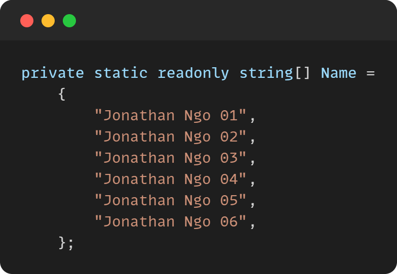
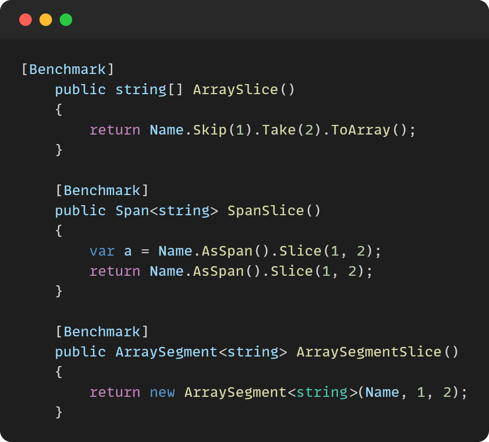
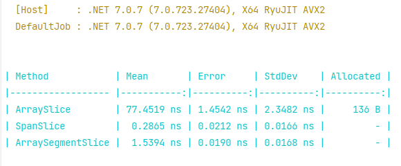
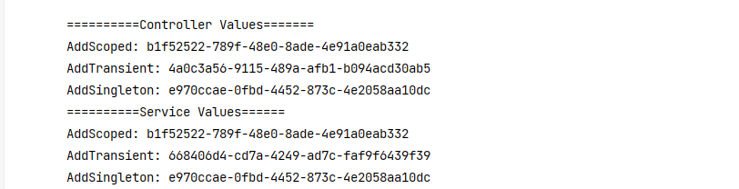
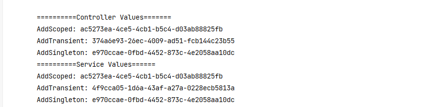

#Notes .NET
Here's what I've learned while applying .NET.

✅ : High recommend

### #1.The power of these types

Define an array: 

Define functions for performance testing: 

The result:

✨ Explanation:

**Array**: We need to allocate memory, so it will take up more memory.
✅ **Span**: We are using pre-allocated memory.
✅ **ArraySegment**: This is not an array; it is a struct wrapper for an array and internally uses pointers and offsets to provide a sort of view.

### #2. (DI) What is different between AddScoped, AddTransient and AddSingleton ?

First Request:

Second Request:

✨ Explanation: 

**Transient** objects are always different; a new instance is provided to every controller and every service.

**Scoped** objects are the same within a request, but different across different requests

**Singleton** objects are the same for every object and every request (regardless of whether an instance is provided in ConfigureServices)

======================
Other parts coming soon...